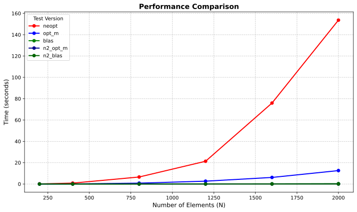
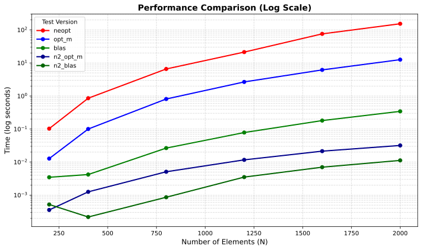
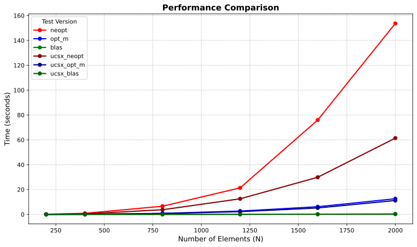
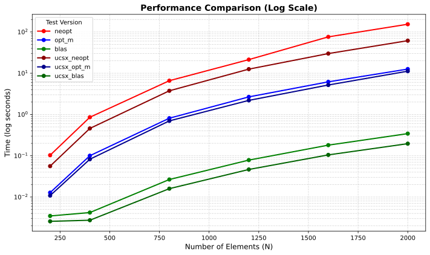

# High-Performance Matrix Operations: Cache Optimization and SIMD Vectorization

## 1. Overview

This repository explores various optimization techniques for dense matrix multiplication and linear algebra operations. The primary objective of this project is to analyze the performance gap between naive algorithmic implementations, manually optimized hardware-aware C code, and highly tuned mathematical libraries (BLAS). 

The project emphasizes memory access patterns, cache utilization, and SIMD (Single Instruction, Multiple Data) vectorization using both AVX2 and AVX-512 instruction sets, alongside mathematical reductions in algorithmic complexity.

## 2. Mathematical Formulation & Strategy

The core mathematical pipeline requires computing a vector $y$ based on a series of matrix operations. To strictly evaluate hardware performance under an $O(N^3)$ computational load, the baseline operation was structured as:

$$y = C(C^t(C^t \cdot 1)) + x$$

This yields an overall complexity of $O(N^3 + 3N^2 + N)$, asymptotically bounded to $O(N^3)$.

**Symmetric Matrix Optimization:**
A key architectural constraint handled in this project is the use of a symmetric matrix $D$. To avoid redundant calculations and minimize memory bandwidth usage, the algorithms are strictly designed to iterate only over the upper triangular portion of the matrix across all implementations.

## 3. Implementation Variants

### 3.1. Naive Baseline (`neopt`)
The baseline implementation relies on the standard matrix multiplication algorithm. It operates without any hardware-level or memory-level optimizations, serving as a reference point for execution time and cache miss rates.

```c
void mat_mul(int N, double *A, double *B, double *C) {
    for(int i = 0; i < N; i++) {
        for(int j = 0; j < N; j++) {
            C[i * N + j] = 0;
            for(int k = 0; k < N; k++) {
              C[i * N + j] += A[i * N + k] * B[k * N + j];
            }
        }
    }
}
```
As expected, this implementation exhibits severe cache thrashing, recording an execution time of **21.4s for N = 1200**.

### 3.2. Manually Optimized (`opt_m` - AVX2)
This variant implements low-level optimizations aimed at maximizing cache locality and CPU pipeline efficiency on Haswell architectures:

1. **Register Caching:** Aggressively caching partial sums in CPU registers to minimize L1 memory accesses.
2. **Loop Unrolling:** Based on the L1 cache line size (64 bytes = 8 double-precision floats), the inner loops are unrolled by a factor of 8 to improve instruction throughput.
3. **Loop Reordering:** Transitioning from the standard `i-j-k` iteration to a `k-i-j` (sequential-constant-sequential) memory access pattern, drastically reducing TLB misses and cache eviction.
4. **AVX2 & FMA Vectorization:** Leveraging 256-bit YMM registers to process 4 double-precision floats concurrently via `_mm256_fmadd_pd` (Fused Multiply-Add).

### 3.3. BLAS Integration (`blas`)
To establish a performance ceiling, the pipeline was implemented using the Basic Linear Algebra Subprograms (BLAS) API, delegating all calculations to assembly-optimized kernels (`cblas_dgemm`, `cblas_dgemv`, `cblas_daxpy`). Specific BLAS flags were utilized to signal the symmetric nature of the target matrices, further pruning the operation tree.

### 3.4. Advanced Vectorization (`ucsx_opt` - AVX-512)
To evaluate horizontal scaling on modern hardware, the algorithms were ported and optimized for Ice Lake-SP architectures supporting the AVX-512 instruction set. 

This adaptation utilizes 512-bit ZMM registers, doubling the SIMD throughput to 8 double-precision floats per clock cycle. A major hardware advantage exploited in this variant is the availability of direct reduction instructions (`_mm512_reduce_add_pd`), which entirely eliminated the need for the manual bit-shifting reduction algorithms required in the AVX2 implementation.

## 4. Algorithmic Complexity Reduction: $O(N^2)$

While the previously mentioned implementations focus on optimizing hardware execution for $O(N^3)$ operations, a parallel approach was developed to attack the mathematical bottleneck itself. 

By fully unpacking the matrix equations, exploiting the associative property of matrix multiplication, and grouping the final vector additions, the operation was reduced entirely to sequential matrix-vector multiplications:

$$y = A^t(B(B^t(A(B^t(A \cdot 1))))) + x$$




This effectively lowers the time complexity from $O(N^3)$ to $O(N^2)$. This algorithmic bypass avoids the computational penalties of standard matrix multiplication entirely, shifting the bottleneck from processor arithmetic limits strictly to memory bandwidth.

## 5. Performance Analysis (Valgrind & Cachegrind)

Extensive profiling was conducted across 6 data sizes ($N = 200, 400, 800, 1200, 1600, 2000$).

### 5.1. Cache Behavior & Pipeline Efficiency

| Implementation | Architecture | I refs | D refs | D1 miss rate | Branches | Mispredicts |
| :--- | :--- | :--- | :--- | :--- | :--- | :--- |
| **Baseline (`neopt`)** | Haswell | 7 billion | 4 billion | 3.6% | 194 million | 486k |
| **Optimized (`opt_m`)**| Haswell | 725 million | 554 million | 1.5% | 9 million | 165k |
| **BLAS (`blas`)** | Haswell | 65 million | 25 million | 4.3% | 4 million | 83k |
| **AVX-512 (`ucsx`)** | Ice Lake | 725 million*| 554 million*| 1.5% | 9 million | 165k |

*\*Note: Valgrind's instruction simulation does not fully map ZMM intrinsic memory accesses (e.g., `_mm512_loadu_pd`), rendering the simulated cache references identical to the AVX2 fallback. However, physical execution times reflect the AVX-512 throughput advantage.*

**Key Takeaways:**
* **Memory Referencing:** The use of `register` variables and optimized memory pointers reduced data referencing by almost 90% (from 4 billion to 554 million) in the manual implementation.
* **Branch Prediction:** Loop unrolling effectively decimated branch instruction overhead, lowering mispredicts significantly.
* **BLAS Efficiency:** BLAS leverages extreme BMM (Block Matrix Multiplication) and aggressive prefetching. While its L1D miss rate is slightly higher, the absolute volume of processed instructions is fractions of the manual implementation.

### 5.2. Scaling & Execution Time




*(Please refer to the SVG plots in the repository for the visual data).*

* **$O(N^3)$ Scaling:** For small workloads ($N = 200$), the execution time difference between `neopt` and `opt_m` is merely 2ms. However, at $N = 2000$, the gap widens to over 141 seconds. The `blas` implementation curve remains practically horizontal on the standard plot, showcasing the immense power of hardware-specific tuning.
* **$O(N^2)$ Scaling:** As seen in the logarithmic plots, the mathematically reduced $O(N^2)$ implementation processes the data with staggering efficiency, demonstrating that algorithmic reduction will always outperform pure hardware scaling when dealing with large $N$ datasets.

## 6. Hardware Specifications

To ensure exact reproducibility, benchmarking was performed on two distinct server architectures:

| Specification | Haswell-EP (AVX2 Baseline) | Ice Lake-SP (AVX-512 Target) |
| :--- | :--- | :--- |
| **CPU Model** | Intel Xeon E5-2640 v3 | Intel Xeon Gold 6326 |
| **Topology** | 16 Cores / 32 Threads (Dual Socket) | 32 Cores / 64 Threads (Dual Socket) |
| **Clock (Base / Turbo)** | 2.60 GHz / 3.40 GHz | 2.90 GHz / 3.50 GHz |
| **Instruction Sets** | AVX, AVX2, FMA | AVX2, AVX-512, FMA |
| **L1 Cache (Data)** | 32 KB per core (8-way) | 48 KB per core (12-way) |
| **L2 Cache** | 256 KB per core (8-way) | 1.25 MB per core (20-way) |
| **L3 Cache (Shared)** | 20 MB per socket (20-way)| 24 MB per socket (12-way) |
| **RAM Type** | DDR4 (max 1866 MHz) | DDR4 (max 3200 MHz) |
| **Compilers** | gcc 15.2.0 | gcc 15.2.0 |

## 7. Conclusion

This project successfully demonstrates the severe performance implications of both hardware-aware programming and algorithmic architecture. While memory access patterns, cache locality, and SIMD vectorization can optimize execution times by multiple orders of magnitude on modern CPUs, the mathematical reduction to $O(N^2)$ proves that algorithmic complexity remains the ultimate dictator of scaling limits. Bridging the gap between pure mathematics and hardware execution pipelines is critical for modern High-Performance Computing.
